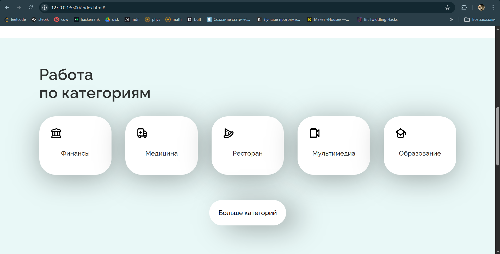

# WorkSearch

Учебный фронтенд-проект (лендинг) для сервиса поиска работы.  
Сделан на чистых `HTML`, `CSS` и `JavaScript`.

## Превью



## Возможности

- Главная страница сервиса поиска работы.
- Блоки с категориями, новыми вакансиями и футером.
- Адаптивные стили для небольших экранов.
- Простая модалка регистрации (открытие/закрытие по клику).

## Технологии

- HTML5
- CSS3
- Vanilla JavaScript

## Структура проекта

```text
worksearch/
├─ index.html
└─ src/
   ├─ index.js
   ├─ style.css
   ├─ adaptive.css
   └─ images/
```
